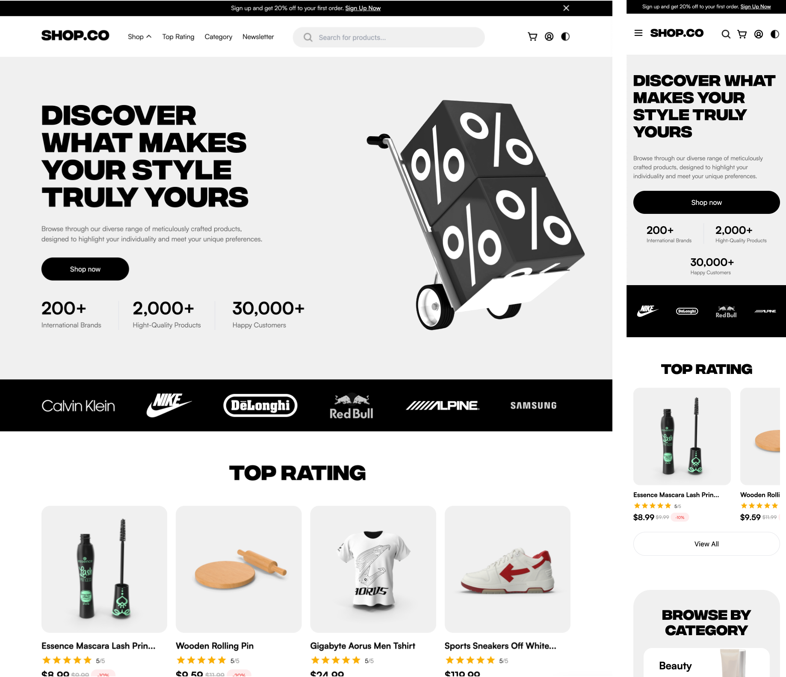
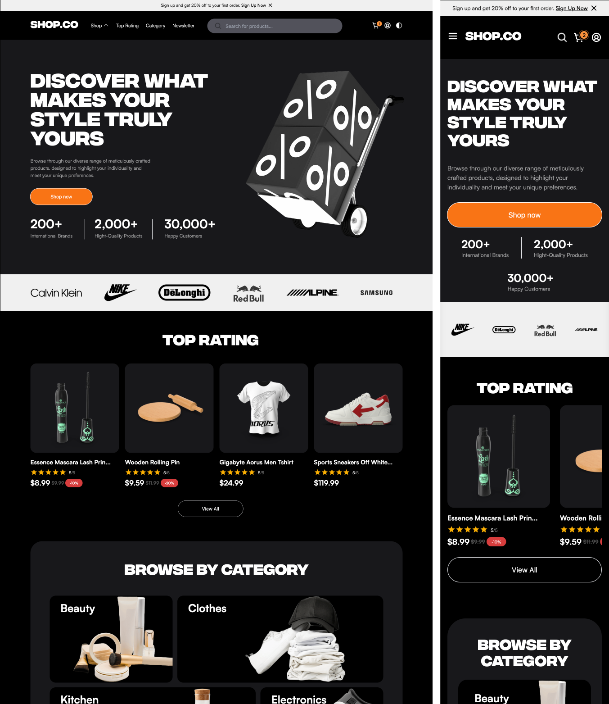
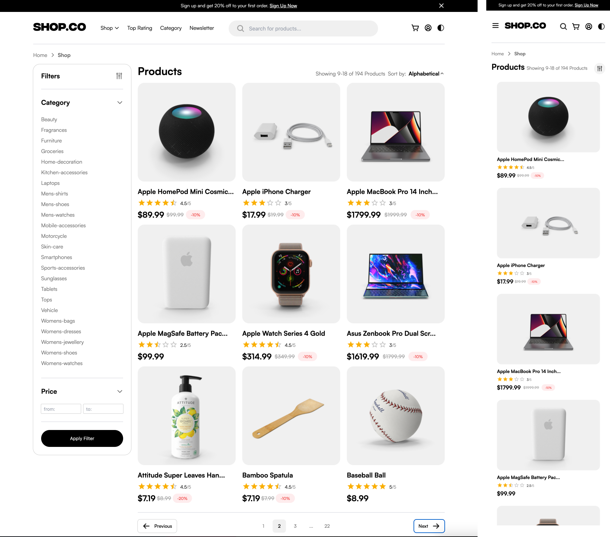
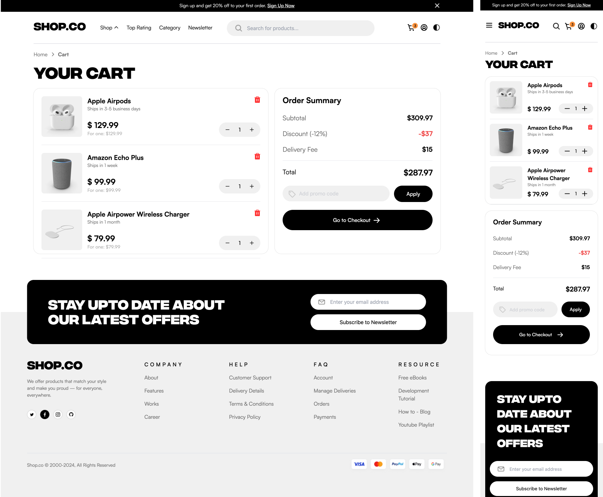
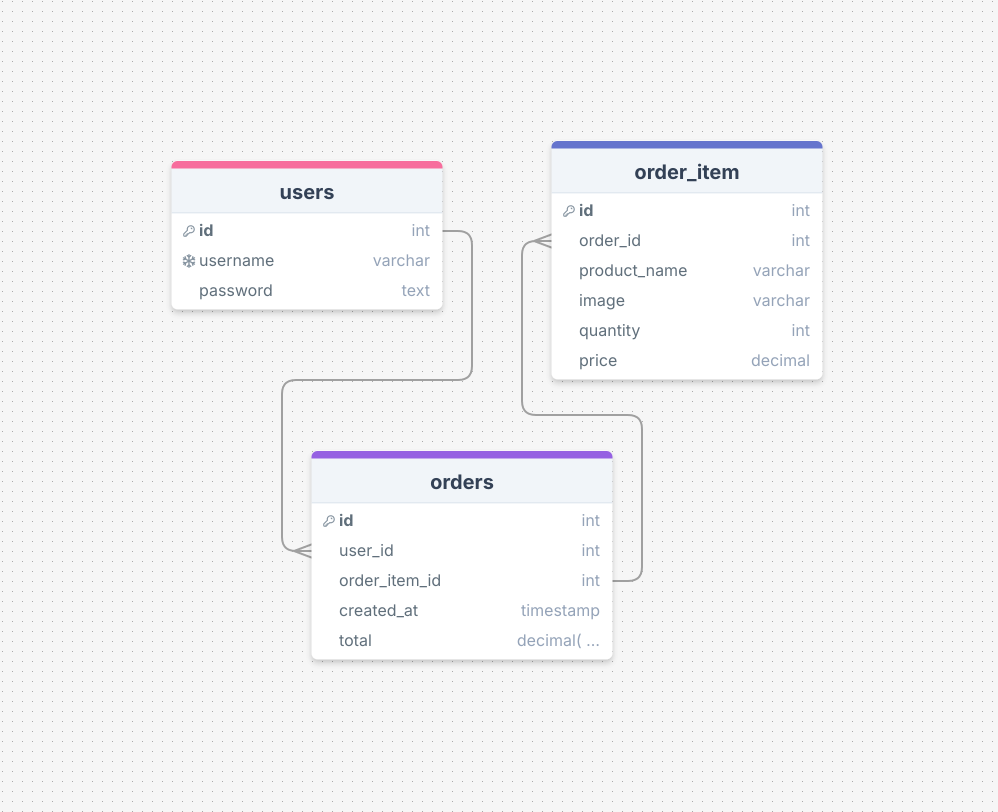

# Shop.co

Witam w moim projekcie **Shop.co**! Projekt powstał na podstawie darmowego layoutu z Figma: [E-commerce Website Template (Freebie)](https://www.figma.com/community/file/1273571982885059508/e-commerce-website-template-freebie). Celem projektu jest przećwiczenie pracy z nowoczesnymi narzędziami frontendowymi i backendowymi.


## Funkcjonalności

- **Responsywność**: Aplikacja dostosowuje się do różnych rozmiarów ekranu.
- **Zarządzanie stanem**: Wykorzystanie **Redux ToolKit** do zarządzania globalnym stanem aplikacji.
- **Wyszukiwarka produktów**: Użytkownicy mają do dyspozycji wyszukiwarkę produktów.
- **Katalog Produktów**:
  - Aplikacja wyświetla produkty wraz z ich zdjęciami, opisami, cenami i kategoriami.
  - Funkcje **filtrowania** oraz **sortowania** produktów (np. według ceny, kategorii).
- **Koszyk zakupowy** – Uzytkownicy mogą korzystać ze wszystkich funkcjonalności koszyka zakupowego.
- **Zarządzanie użytkownikami**: Dodawanie i przechowywanie użytkowników w bazie danych.
- **Uwierzytelnianie użytkowników**: Po zalogowaniu, użytkownicy mogą dodawać produkty do koszyka i składać zamówienie.
- **Proces realizacji zakupów** – Użytkownicy przechodzą cały proces zakupowy.
- **Panel uzytkownika** – Uzytkownik ma dostęp do informacji o swoim koncie, jak również do historii zakupów.
- **Obsługa motywów**: Użytkownik ma możliwość przełączania między **jasnym** a **ciemnym** motywem.

## Zrzuty ekranu

### Widok główny



### Widok główny - ciemny



### Widok główny - produkty



### Koszyk zakupowy 



### Schemat bazy danych (w przyszłości rozszerzony)




## Technologia

Projekt został zbudowany z wykorzystaniem następujących technologii:

### FRONTEND:

- **React**: JavaScriptowy framework do budowy interfejsów użytkownika.
- **React-Router**: Biblioteka do zarządzania trasami w aplikacji React.
- **React Hook Form**: Narzędzie do obsługi formularzy w React.
- **TanStack Query**: Narzędzie do zarządzania stanem danych z API.
- **TypeScript**: Superset JavaScriptu, który zapewnia statyczne typowanie, co poprawia niezawodność i stabilność aplikacji.
- **TailwindCSS**: Nowoczesny framework CSS.
- **Vite**: Nowoczesne narzędzie do budowy aplikacji frontendowych.
- **Redux Toolkit**: Biblioteka do globalnego zarządzania stanem aplikacji.
- **Material-UI (MUI)**: Framework CSS do stylizowania komponentów.
- **Zod**: Biblioteka do walidacji danych.
- **DummyJSON**: Zewnętrzne API, które dostarcza dane produktów, takie jak opisy, ceny, zdjęcia i kategorie (dokumentacja: [https://dummyjson.com/docs](https://dummyjson.com/docs)).
- **API REST**: Obsługa danych przez endpointy API.
- **Vitest** i **React Testing Library**: Narzędzia do testów jednostkowych.


### BACKEND:

- **Node.js/Express.js**: Platforma i framework używane do tworzenia serwera oraz logiki backendowej.
- **MySQL**: Relacyjna baza danych używana do przechowywania danych.
- **JWT (JSON Web Tokens)**: Technologia wykorzystywana do uwierzytelniania użytkowników.
- **CORS**: Middleware umożliwiający współdzielenie zasobów między różnymi domenami.
- **bcryptjs**: Biblioteka służąca do bezpiecznego haszowania haseł użytkowników przed ich zapisaniem w bazie danych.
- **Docker**: Narzędzie do konteneryzacji, które umożliwia łatwe wdrażanie i zarządzanie aplikacją w odseparowanych środowiskach.
- **Postman**: Narzędzie do testowania i dokumentowania API. Pliki kolekcji testów oraz środowiska znajdują się w katalogu `postman/`.

Projekt jest skonfigurowany do uruchamiania w kontenerach Docker, co umożliwia łatwą współpracę między frontendem i backendem oraz zapewnia spójność środowiska wdrożeniowego.

## Instalacja

Aby zainstalować projekt, wykonaj poniższe kroki:


1. **Sklonuj repozytorium:**
   Forkuj repozytorium na swoim koncie GitHub, a następnie sklonuj je lokalnie.
   ```sh
   git clone https://github.com/ozematt/Shop.co_fullstack.git
   ```
2. **Przejdź do katalogu projektu:**
   ```sh
   cd Shop.co_fullstack
   ```
   
3. **Zbuduj i uruchom kontenery:**
   Upewnij się, że masz zainstalowany i włączony Docker. Następnie uruchom poniższą komendę.
   ```sh
   docker-compose up --build
   ```

5. **Dostęp aplikacji:**
   - **Frontend**: http://localhost:5173/
   - **Backend**: http://localhost:3005/


## Testowanie API przy użyciu Postmana
   Musisz mieć zainstalowany Postman.

Aby zaimportować testy:
1. Otwórz Postmana.
2. Wybierz `Import`.
3. Wskaż plik `postman/api-tests.postman_collection.json`.
4. Zaimportuj środowisko `postman/local-environment.postman_environment.json`.

## Funkcjonalności w trakcie przygotowania

- **Baza danych**: Rozbudowa bazy danych.

Dziękuję za odwiedzenie repozytorium! 😊
